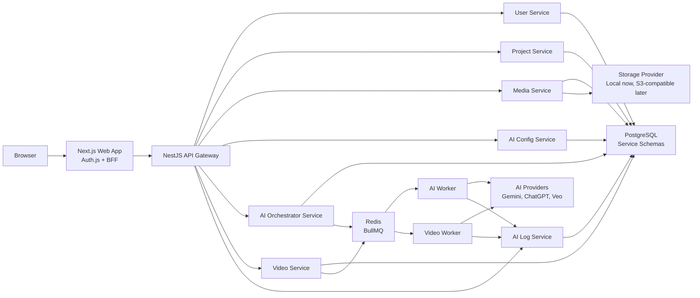

# 02 - System Architecture

## 1. High-Level Architecture



## 2. Runtime Responsibilities

### 2.1. Next.js Web App

Responsibilities:

- Render public home page, user dashboard and admin dashboard.
- Own Auth.js routes and session UX.
- Protect route groups by authenticated role.
- Upload media using signed or proxied upload endpoints.
- Display job progress and AI generation results.

The web app should not contain core project, media, AI or video business logic.

### 2.2. API Gateway

Responsibilities:

- Expose public REST APIs to the web app.
- Validate requests and normalize responses.
- Enforce authentication and RBAC.
- Forward commands/queries to services.
- Return job IDs for long-running operations.
- Expose OpenAPI documentation.

The API Gateway is not a database owner. It may cache read results, but it should not own domain persistence.

Current local implementation note:

- The first database-backed vertical slice lets the API Gateway call Prisma across service-owned schemas directly so the app can run without source-code sample data or process-local stores.
- This is a temporary integration step. The schema ownership and service boundaries below remain the target, and the direct Prisma calls should move behind service modules as the services are wired.

### 2.3. Domain Services

Each service owns one business capability:

- User and role profile data.
- Project ownership and project metadata.
- Media validation and metadata.
- AI configuration and encrypted provider keys.
- AI prompt/script/product/media orchestration.
- Video generation records and status.
- AI request/response logs.

Services should communicate through the gateway for client-facing flows and through jobs/events for async workflows.

### 2.4. Workers

Workers execute long-running tasks:

- AI prompt/script generation.
- Product URL analysis.
- Media analysis.
- Video generation.
- Provider retry and timeout handling.

Workers must be idempotent because retries can run the same job more than once.

## 3. Communication Model

### 3.1. Browser to Backend

Browser calls the Next.js app. The Next.js app calls the API Gateway.

Preferred pattern:

- Browser renders pages through Next.js.
- Auth.js manages session cookies.
- Next.js server code calls the API Gateway with an internal signed token derived from the Auth.js session.
- Client Components call BFF endpoints only when browser-side interaction is required.

This keeps provider secrets and internal service URLs out of the browser.

### 3.2. Gateway to Services

Use HTTP/REST initially.

Rules:

- Every request includes `x-request-id`.
- Every service validates caller identity or service token.
- DTOs are shared through a small `packages/contracts` package.
- Services return domain errors in a consistent error envelope.

### 3.3. Async Jobs

Use BullMQ queues for long-running tasks.

Recommended queues:

- `media.analysis`
- `ai.prompt`
- `ai.productAnalysis`
- `video.generation`
- `ai.log`

Job status should be queryable through the API Gateway.

## 4. Local Development Topology

Use Docker Compose for shared infrastructure:

- PostgreSQL.
- Redis.
- Local storage volume.

Current local ports:

- PostgreSQL: `localhost:55432`.
- Redis: `localhost:56379`.

Run apps/services separately during development:

- `apps/web`
- `apps/api-gateway`
- `services/user-service`
- `services/project-service`
- `services/media-service`
- `services/ai-config-service`
- `services/ai-orchestrator-service`
- `services/video-service`
- `services/ai-log-service`
- `workers/worker-ai`
- `workers/worker-video`

## 5. Recommended Monorepo Layout

```text
apps/
  web/
  api-gateway/
services/
  user-service/
  project-service/
  media-service/
  ai-config-service/
  ai-orchestrator-service/
  video-service/
  ai-log-service/
workers/
  worker-ai/
  worker-video/
packages/
  contracts/
  config/
  logger/
  errors/
  auth/
  storage/
  ai-providers/
  database/
infra/
  docker-compose.yml
  postgres/
  redis/
docs/
  tsd/
```

## 6. Deployment Direction

Initial deployment:

- One container per app/service/worker.
- One PostgreSQL cluster with service schemas.
- One Redis instance.
- One shared storage volume or mounted local storage.
- The current single-tester VPS deployment guide lives in `deploy/README.md`. It uses Caddy, Next.js, the API Gateway, PostgreSQL and Redis on one server, and should be treated as a pragmatic test deployment rather than the final scaled topology.
- For short customer tests from a developer machine, `deploy/cloudflare-tunnel/README.md` documents a Cloudflare Tunnel mode that publishes the local web app and API through one protected hostname without opening local inbound ports.

Production direction:

- Replace local storage with S3-compatible object storage.
- Add centralized logs and metrics.
- Add service autoscaling for workers.
- Split high-volume services into separate database clusters only when needed.
