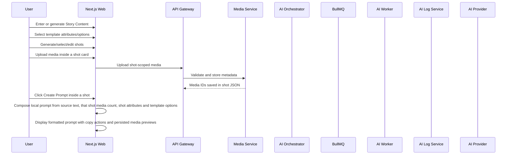
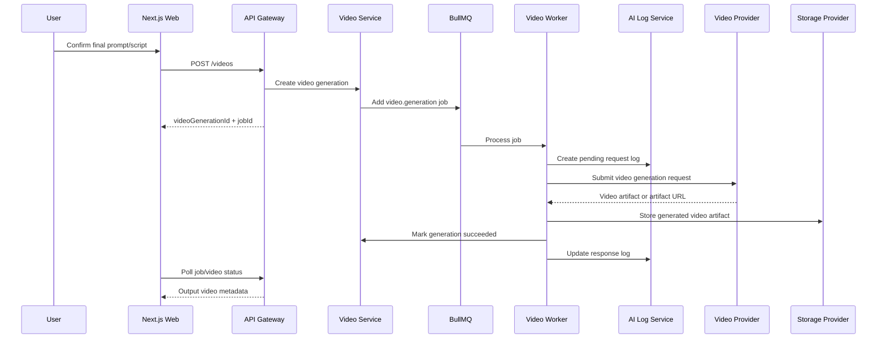

# 06 - AI and Media Workflows

## 1. Design Goals

- Keep AI provider secrets on the server.
- Log request data before calling AI.
- Log response or error after AI returns.
- Support uploaded image/video references in prompt generation and product analysis.
- Keep long-running operations asynchronous.
- Allow providers and models to be changed by admin without code changes.
- Persist workflow state in PostgreSQL instead of source-code sample data or process-local state.

Current local implementation:

- Media metadata and validation status are stored in `media.media_assets`.
- Prompt/product/video jobs are stored in `jobs.job_statuses`.
- AI request/response logs are stored in `ai_logs`.
- Prompt and product analysis results are stored in `content.prompts`.
- Script results are stored in `content.scripts`.
- Template definitions are stored in `content.video_templates`.
- Template selections used during prompt/product analysis are stored in request payload and prompt provider metadata.
- Shot plans are stored in `content.video_shot_plans` as user-owned reusable assets; `project_id` is nullable for user-level plans.
- Shot selections used during prompt generation are stored in request payload and prompt provider metadata.
- Admin master prompts are stored in `config.master_prompts` by type: `scenario`, `shots` and `scripts`. Runtime AI requests require an active default prompt for the relevant type; legacy prompt columns are retained only for admin/read compatibility and are not runtime fallbacks.
- Video generation records are stored in `video.video_generations`.
- Provider SDK calls and BullMQ workers are still follow-up work; current provider-shaped results are produced by the API vertical slice and persisted immediately.

## 2. Scenario



## 2.0.1. One Click Scenario Shortcut

One Click reuses the Scenario data model and AI workflows instead of adding a new backend flow type:

1. `/one-click` creates a normal project with `flowType = script`, setup name and setup description.
2. `/one-click/{projectId}` renders a guided one-step-at-a-time UI.
3. Step 1 calls the existing Script prompt/content generation workflow and writes the response back into `Story Content`; manually entered Story Content is also saved before the wizard advances.
4. Step 2 is a Scenario step: it renders the active `Scenario` master prompt with Story Content and uses the scenario/template catalog. The UI hides the `Choose scenario` dropdown but still calls `template_selection` when the user clicks `Analyze scenario`.
5. Successful Step 2 analysis saves the selected scenario attributes/options to the project and creates a Scenario record named/described from the One Click setup so later prompt composition and shot generation can reuse them.
6. Step 3 calls `shot_generation` with the Step 1 Story Content, temporary `Shots` master prompt and selected scenario attributes when present. One Click does not show an existing shot-plan selector; the project-scoped shot generation endpoint is used so the resulting shot plan is saved, linked to the project and named/described from the One Click setup.
7. After a shot card exists, the user can open `Prompt` to inspect the composed per-shot prompt without calling AI, or click `Create video` to submit that prompt to the configured video provider/model through `POST /api/v1/projects/{projectId}/videos`. The shot-level Request/Response popups show the redacted provider request and response/job error for that shot. Provider failures must mark the video job failed and must not create fallback video success data.
7. Generated shot plans, raw request/response logging, provider errors and prompt preview behavior remain the same as Scenario.

## 2.1. Template Generation Flow

Steps:

1. User opens the `Template` page.
2. User enters a video idea, for example `tạo 1 video về ngày vui của bé`.
3. UI shows the active admin-managed `Scenario` master prompt in an editable textarea. Edits are temporary for this generation and are sent as optional `masterPrompt`; they do not overwrite the admin default.
4. API reads active prompt provider/model config and the selected `Scenario` master prompt. Placeholder replacement for `{story}` and `{attributes}` is optional, and backend does not append hidden runtime context or output contract text.
5. System creates an AI request log with flow type `template_generation` before submitting to the provider.
6. AI produces template JSON with attributes and options.
7. System stores the template in `content.video_templates`.
8. Success returns the saved template plus redacted `rawRequest`, `rawResponse`, provider and model so the Scenario create/edit UI can show `Request` and `Response` debug popups next to `Generate scenario with AI`.
9. If provider execution fails because the key is missing, quota is exhausted, HTTP fails, response text is empty, JSON is invalid or the JSON does not match the scenario-template contract, the API returns `AI_CONFIG_MISSING`, `AI_RATE_LIMITED` or `AI_PROVIDER_FAILED` with safe readable details. Raw provider payloads stay in Admin > AI Logs.
9. The system must not fallback to fake/sample scenario data when AI fails.
10. User can edit, add attributes, add options, or paste compact schema text such as `videoPurpose=Storytelling,Commercial;` before saving the normalized JSON.
11. Project workspace loads active templates and renders each attribute option as a checkbox.
12. User can select multiple options per attribute.
13. Prompt/product analysis request includes `templateSelection`.

## 2.1.1. Project Template Selection Analysis

Steps:

1. User enters or generates `Story Content` in Step 1 of a Scenario project workspace.
2. Workspace loads the admin-managed `Scenario` master prompt in Step 2. User can edit this master prompt temporarily for the current analysis.
3. User chooses a Kịch bản/scenario template.
4. User clicks `Analyze scenario`.
5. API creates an AI request log with flow type `template_selection`.
6. API replaces optional `Scenario` placeholders (`{story}`, `{attributes}`) when present, then sends exactly the rendered master prompt to the active prompt provider/model. If the request omits a temporary master prompt, the API uses the admin-managed `Scenario` default. If that default is missing, the request fails with `AI_CONFIG_MISSING`.
7. Provider returns strict JSON containing selected option IDs and a compact selection string such as `genre=Folk Tale;`.
8. API validates that selected option IDs belong to the user's active template, normalizes the result to `templateSelection`, saves it in `projects.projects.template_selection` and stores raw request/response in the job/log result.
9. Workspace applies the returned option IDs as checked boxes and shows a `Prompt` button before `Request` beside `Analyze scenario`; `Prompt` opens exactly the rendered prompt after placeholder replacement. Adjacent `Request`/`Response` buttons open read-only popups with the latest raw data for the run. User can edit the checkboxes and save the current selection back to the project.
10. If scenario analysis fails, the failed job must include a stable `ApiError` code, message and safe details such as provider, model, HTTP status or schema issue count. The workspace must show those details inline under `Analyze scenario` with an actionable explanation. API keys and secrets must stay redacted in both user popups and admin AI logs.

## 2.2. Prompt Preview Before Submission

The web app may show a read-only preview dialog before a prompt/product analysis request is submitted. The preview is client-side only and must not call an AI provider.

The preview should include:

- Target API endpoint.
- Request body fields such as `inputText` or `productUrl`.
- Validated `mediaIds` and media metadata references. In Scenario, these are scoped through the selected shot JSON.
- Selected shots and shot attributes.
- Selected template attributes/options.
- A composed instruction preview that explains how the text, media, shot selections and template selections will guide the AI request.

This preview is not a substitute for server-side request logging. The API Gateway and AI Orchestrator still create authoritative AI request logs before provider execution.

## 2.3. Shot Generation Flow

Steps:

1. User opens a `Scenario` project.
2. User enters or generates Step 1 `Story Content`. Standalone `/shots*` pages are no longer user-facing and redirect to `/projects`; shot plan generation and editing happen inside Project and One Click workspaces through project-scoped endpoints.
3. In the project workspace, the UI shows the active `Shots` master prompt in an editable textarea and sends selected Step 2 Kịch bản/scenario options plus Step 3 Shots options only through explicit placeholders in that prompt.
4. User clicks `Generate Shots`.
5. API reads active prompt provider/model config and uses the temporary request `masterPrompt` override when present, otherwise the active `Shots` master prompt. Prompt placeholders such as `{story}`, `{attributes}`, `{scenarioAttributes}` and `{shotsAttributes}` are optional compatibility; backend sends exactly the rendered master prompt without hidden runtime context.
6. System creates an AI request log with flow type `shot_generation`.
7. API calls the active prompt provider using the encrypted provider key saved in Admin > AI Config. Environment API keys are not runtime fallback sources. `chatgpt`/`openai` uses the OpenAI Responses API.
   - Gemini receives the richer response JSON schema with duration bounds.
   - ChatGPT receives a provider-compatible strict JSON schema with `additionalProperties: false` on every object; duration bounds are enforced during backend normalization.
8. User-facing script create/edit pages expose `Prompt`, `Request` and `Response` buttons for this workflow; the full prompt is computed before submission and the raw request/response popups use the completed job result.
8. AI must return strict JSON with `name`, `durationSeconds` and `shots[]`. Each shot includes `title`, `description`, `durationSeconds` and editable `attributes[]`; every shot should include `Start state`, `End state` and `Dialogue`.
9. System stores the redacted raw provider request and raw AI JSON in the AI logs and completed job result. The workspace shows a `Prompt` button before `Request` beside `Generate Shots` so users can inspect exactly the rendered prompt after placeholder replacement; adjacent `Request`/`Response` buttons open read-only popups with the latest raw data for the run.
10. System validates the provider JSON before persistence: required text fields and duration must be present, each shot must include `Start state`, `End state` and `Dialogue`, plan-level attributes are preserved, and invalid/missing required fields fail with `AI_PROVIDER_FAILED`.
11. System stores the normalized shot plan in `content.video_shot_plans`, including owner user ID, nullable source project ID, plan-level `attributes` JSON and per-shot `shots` JSON.
12. If no saved key exists, the job fails with `AI_CONFIG_MISSING`. If the provider returns quota/rate-limit status such as HTTP `429`, the job fails with `AI_RATE_LIMITED`. If the provider fails for other reasons or returns invalid/contract-mismatched JSON, the job fails with `AI_PROVIDER_FAILED`. The system must not fallback to fake or mock shot generation.
13. User can edit, add or remove shots, arbitrary shot attributes and the dedicated per-shot dialogue/voiceover textarea.
14. User can upload reference media inside each shot card; validated media IDs are stored in that shot JSON as `mediaIds`.
15. Any project workspace owned by the same user can load and select the saved shot plan, then compose a local prompt for each shot from the shot JSON, that shot's media references and the current template selection.
16. Media-aware prompt popups show the saved image/video preview and metadata. Prompt copy remains text-only and does not copy image binaries from the media card or popup.
17. The per-shot `Create Prompt` action uses the legacy local composer prompt from `config.ai_site_configs.shot_composer_prompt` or its built-in default, then appends structured shot context locally. Attribute placeholders render bracketed rows such as `[Start State]: ...`, `[Action & Motion]: ...`, `[End State]: ...`, and `[Voiceover Script]: "..."` for the `Dialogue` value. It must not call an AI provider.

## 2.4. Script Prompt/Content Generation

Steps:

1. User edits Step 1 `Story Content`, optionally edits the visible `Story Content` master prompt, then clicks `Generate Story Content`.
2. API reads the active prompt provider/model config and uses the temporary request `masterPrompt` when present; otherwise it uses the active `Story Content` master prompt. If the active prompt is missing, the request fails with `AI_CONFIG_MISSING`. The persisted type key remains `scripts`.
3. Backend replaces optional `Story Content` placeholders (`{inputText}`, `{mediaSummary}`, `{shotSelection}`, `{scenarioSelection}`) when present, then sends exactly the rendered master prompt. Runtime data is included only when the selected prompt contains the relevant placeholder.
4. API creates an AI request log with flow type `prompt_generation`, calls the active provider/model, and stores the redacted raw provider request plus raw provider response in the completed job/AI logs.
5. The generated provider text is written back into the workspace `Story Content` textarea. The workspace shows a `Prompt` button before `Request` beside `Generate Story Content` so users can inspect exactly the rendered prompt after placeholder replacement; adjacent `Request`/`Response` buttons open the latest raw provider payloads in read-only popups. That textarea becomes the source of truth for scenario analysis, shot generation, per-shot prompt composition and script creation.
6. If no saved key exists, the job fails with `AI_CONFIG_MISSING`. If the provider returns quota/rate-limit status such as HTTP `429`, the job fails with `AI_RATE_LIMITED`. If the provider fails or returns empty text, the job fails with `AI_PROVIDER_FAILED`. The system must not fallback to local/sample Story Content.
7. The workspace shows the failure inline under `Generate Story Content` with a readable explanation, stable error code, provider/model when available, env/status hints when relevant and the job ID for admin lookup. Raw provider payloads are only shown through successful run popups and Admin > AI Logs, with secrets redacted.

## 3. Product URL Flow

Steps:

1. User enters product URL.
2. User optionally uploads media references.
3. Media Service validates file type, size and duration.
4. User clicks `Analyze Product`.
5. API Gateway sends command to AI Orchestrator.
6. AI Orchestrator creates `ai.productAnalysis` job.
7. Worker fetches active AI config.
8. Worker creates AI request log.
9. Worker calls selected provider/model with product URL and media references.
10. Worker updates response log.
11. Generated analysis and prompt are stored.
12. User edits final prompt.
13. User creates script or video depending on admin content mode.

Current local slice collapses steps 5-10 into the API Gateway while still writing the same database records that the future services/workers will own.

## 4. Video Generation Flow



## 5. Media Validation Rules

Supported image types:

- `image/jpeg`
- `image/png`
- `image/webp`

Supported video types:

- `video/mp4`
- `video/quicktime`
- `video/webm`

Limits:

- Maximum 10 files per generation flow.
- Maximum 10 MB per image.
- Maximum 200 MB per video.
- Maximum 3 minutes per video.
- Maximum 500 MB total media per generation flow.

Validation stages:

1. Client pre-validation for immediate UX.
2. Gateway request validation.
3. Media Service authoritative validation.
4. Worker-side validation before provider submission.

## 6. Provider Abstraction

Define provider ports:

```text
PromptProvider
  generatePrompt(input): Promise<PromptResult>
  analyzeProduct(input): Promise<ProductAnalysisResult>
  analyzeMedia(input): Promise<MediaAnalysisResult>

VideoProvider
  generateVideo(input): Promise<VideoGenerationResult>
```

Implement adapters:

- `GeminiPromptProvider`
- `ChatGptPromptProvider`
- `VeoVideoProvider`
- `GeminiVideoProvider`

Provider selection comes from AI Config Service.

## 7. AI Request Logging

Before provider call:

- Generate `requestId`.
- Redact secrets.
- Store request payload, provider, model, flow type and media metadata.
- For `shot_generation`, request payload stores the redacted raw provider request that was actually sent to the provider.
- Mark status `pending`.

After provider call:

- Store response payload or error details.
- Store latency.
- Store token usage and estimated cost when available.
- Mark status `success` or `failed`.

Never log:

- API keys.
- Access tokens.
- Refresh tokens.
- Raw binary image/video content.

## 8. Retry and Timeout Policy

Recommended default:

- Prompt/product/media analysis timeout: 60 seconds.
- Video generation request timeout: provider-specific, with async polling when available.
- Retry provider transient errors up to 3 times.
- Use exponential backoff with jitter.
- Do not retry validation errors.
- Do not retry user-cancelled jobs.

## 9. Idempotency

Use idempotency keys for:

- Prompt generation.
- Product analysis.
- Script creation.
- Video generation.

Recommended key:

```text
userId:projectId:operation:clientRequestId
```

Workers must tolerate duplicate job execution and should check whether a result already exists before writing final output.
## 10. Attribute Catalog Workflow

- Story, Scenario, and Shots attributes are admin-managed catalogs, separate from Master Prompts.
- Attribute Generation Prompt is saved per type and is used only for generating or editing catalog JSON. It is not loaded from Master Prompt.
- Attribute generation uses exact placeholder replacement only. The supported generation placeholders are `{inputText}` and `{attributeJsonFormat}`.
- Project and One Click load the active default catalog for each step:
  - Step 1 uses Story attributes.
  - Step 2 uses Scenario attributes.
  - Step 3 uses Shots attributes plus the saved Scenario selection when the prompt asks for it.
- Required attributes auto-select the first option when no saved selection exists. Users may multi-select or change options, but required attributes cannot be empty.
- Master Prompt runtime data is included only when the prompt contains the explicit placeholder:
  - Story Content: `{storyAttributes}`
  - Scenario: `{scenarioAttributes}`
  - Shots: `{scenarioAttributes}` and `{shotsAttributes}`
- The legacy `{attributes}` token remains compatibility-only and should not be expanded for new defaults or docs.
